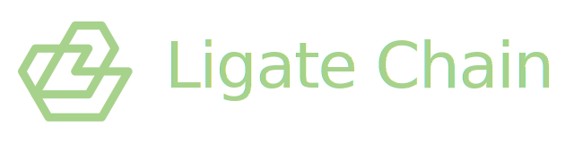
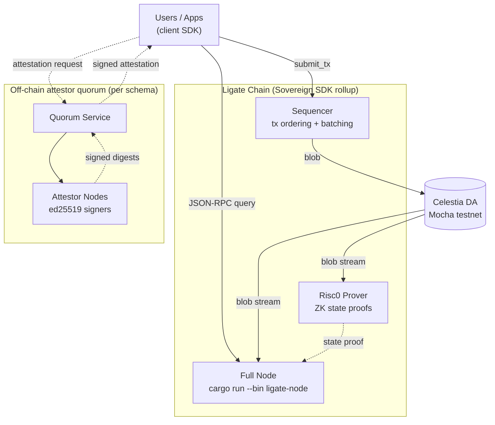

<p align="center">
  <a href="https://ligate.io">
    
  </a>
</p>

<h1 align="center">Ligate Chain</h1>

<p align="center">
  <strong>The permissionless on-chain attestation protocol.</strong><br>
  A sovereign rollup on Celestia. AI provenance is the wedge use case, not the only one.
</p>

<p align="center">
  <a href="https://github.com/ligate-io/ligate-chain/actions/workflows/ci.yml"></a>
  <a href="#license"></a>
  <a href="https://docs.ligate.io"></a>
  <a href="#development-status"></a>
</p>

---

## Quick start

### Build and test

```bash
# Clone
git clone https://github.com/ligate-io/ligate-chain
cd ligate-chain

# Build the workspace (Rust 1.93 auto-installs via rust-toolchain.toml).
# Ubuntu / Debian first install: sudo apt install -y libclang-dev clang
# macOS first install:           xcode-select --install
cargo build --workspace

# Run the workspace tests (lib + integration + doctests)
cargo test --workspace
```

### Run a node

The `ligate-node` binary boots a single-node rollup against the checked-in devnet genesis. Two flavours, sharing the same chain state and only differing in DA layer:

```bash
# Default: in-process MockDa (SQLite). Single command, no external services.
cargo run --bin ligate-node

# Real Celestia DA (Mocha public RPC). Needs a Celestia signer key.
SOV_CELESTIA_RPC_URL=wss://celestia-mocha.public-rpc.com \
SOV_CELESTIA_SIGNER_KEY=$(pass celestia/devnet-signer) \
cargo run --bin ligate-node -- --da-layer celestia
```

Defaults pick up `devnet/rollup.toml` (or `devnet/celestia.toml`) and the `devnet/genesis/*.json` files. The bootstrap account holds treasury, sequencer, attester, and prover roles for v0; two extra accounts (`lig1d0vqhk…` and `lig1njjery…`) ship with `$LGT` so you can exercise transfers without minting.

A public devnet with federated attestor orgs is targeted for **Q2 2026**. Until then the protocol runs single-node locally as above. Per-flavour boot details (Mock / Celestia, env vars, secret-store helpers) live in [`devnet/README.md`](devnet/README.md). Forward-looking operator notes (genesis ceremony, attestor key generation, multi-org topology) are in [`docs/development/devnet.md`](docs/development/devnet.md) — note that runbook still has sections marked **Preview only** from before Phase A landed; refresh tracked separately.

## What is this repo

This repository holds the **Ligate Chain protocol** and its first-party SDKs. Its one core product in v0 is a generic **attestation protocol**: anyone can register an attestor set and a schema, then submit cryptographically signed records ("attestations") under it that anyone can verify later. The chain stores only hashes and signatures, never plaintext payloads.

Product-specific code (Themisra, Iris, Kleidon) lives in separate repositories. Those products are the first consumers of this protocol, not part of it. They register their own schemas and attestor sets and submit attestations through the same public interface any other builder would use.

Who this repo is for:

- **App builders** who want to attach a verifiable, on-chain receipt to something that happened off-chain (model inferences, purchases, tickets, state transitions). The protocol is deliberately narrow and generic.
- **Node operators** running or planning to run a Ligate Chain node.
- **Protocol contributors** working on the rollup, the module, or the SDK.

The canonical specification is in [`docs/protocol/attestation-v0.md`](docs/protocol/attestation-v0.md). Read it before opening a non-trivial PR against `crates/modules/attestation`.

## What Ligate Chain is, and isn't

Ligate Chain is a **specialized app-chain**, not a general-purpose smart-contract platform. The closer comparisons are Celestia, Hyperliquid, dYdX v4, or Cosmos app-chains: each chain has a narrow remit and is shaped around it. Our remit is on-chain attestation infrastructure — any cryptographically signed off-chain record, verifiable later by anyone, with the curated module set (tokens, NFTs, payments, identity, agents) layered around it. AI provenance is the highest-conviction wedge use case (via Themisra) but the protocol is domain-agnostic: anyone registers a schema and an attestor set, anyone submits attestations under it.

**It is:**

- A sovereign rollup on Celestia DA. Own state, own token ($LGT), own sequencer, own protocol logic.
- A curated module set. Today: `attestation`. Planned: `tokens` ([#47](https://github.com/ligate-io/ligate-chain/issues/47)) and `nft` ([#48](https://github.com/ligate-io/ligate-chain/issues/48)) in v1, `payments`, `agents`, `identity`, `disputes` later. Each module is a designed product surface, not a sandbox.
- Permissionless at the **schema** level: anyone registers a schema on the attestation module and submits attestations under it. No gatekeeper.

**It isn't:**

- An EVM chain in v0 / v1 / v2 / v3. There is no Solidity, no contract deployment, no ERC-20 deploy via tx in any of those phases. Tokens and NFTs come through the curated `tokens` and `nft` modules. EVM compatibility is tracked as a long-horizon v4 option ([#52](https://github.com/ligate-io/ligate-chain/issues/52)) we will revisit only after the attestation focus has paid off in shipped, in-production users; until then we don't dilute the chain identity for it.
- An L1 in the Bitcoin / Ethereum sense. We use Celestia for data availability rather than building our own DA layer. We are sovereign in the rollup sense (no settlement to Ethereum, our own validator set), but DA is outsourced.
- An L2 in the Optimism / Arbitrum sense. We do not settle to Ethereum.
- A general DeFi platform. The chain is shaped for attestation primitives plus a few sister modules. Lending, AMMs, perps, and similar live on chains designed for them.

**What you can build on Ligate Chain today and through the v1 roadmap:** apps that register schemas and submit attestations (any domain — AI provenance, supply-chain, document notary, oracle data, governance receipts, KYC checkpoints, sensor logs, you name it); apps that issue fungible tokens or NFTs once `tokens` ([#47](https://github.com/ligate-io/ligate-chain/issues/47)) and `nft` ([#48](https://github.com/ligate-io/ligate-chain/issues/48)) modules ship; apps that compose with payments, identity, agent registry, and disputes modules as those land. **What you can't build today:** anything requiring arbitrary smart-contract execution (no EVM in v0–v3; tracked as a v4 option in [#52](https://github.com/ligate-io/ligate-chain/issues/52)). For chain-shaped Web3 features through curated modules + a permissionless attestation primitive, this is the chain. For arbitrary Solidity/Rust contracts, an EVM L2 or Solana is the right place today.

## Architecture



### How nodes coordinate

Ligate Chain is a **sovereign rollup**, not a peer-to-peer blockchain. Full nodes do not gossip with each other. Each node:

1. Subscribes to a Celestia namespace and pulls the rollup's blobs as they appear.
2. Independently runs the STF over each blob to derive the chain state.
3. Serves JSON-RPC queries against its own derived state.

Coordination happens through two places, **never through node-to-node messaging**:

- **The sequencer** is the canonical entry point for transactions. Users submit transactions to its RPC; it batches them, picks an order, and posts the batch as a blob to Celestia. In v0, Ligate Labs runs the only sequencer; multi-sequencer (leader rotation, based-rollup) is a v1+ direction.
- **Celestia** is the source of truth for inclusion and ordering. Every node sees the same blob stream and therefore reaches the same state. The chain's "consensus" is delegated to Celestia's DA + ordering — the rollup itself only enforces the STF. Disagreements about state are impossible if a node has correctly executed the STF over the same blobs.

This is the standard rollup model. Same shape as every Sovereign SDK rollup, every modern Cosmos app-chain on Celestia (Stride, Dymension), and every Ethereum L2 (Optimism, Arbitrum, Base) — minus settlement back to Ethereum, since we are sovereign and don't post proofs to an L1.

### Attestors are application-layer, not consensus

Attestor nodes are **not** chain consensus participants. They sign attestation digests off-chain on behalf of a particular schema's quorum:

1. The schema's off-chain **quorum service** (e.g. Themisra's attestor service for `themisra.proof-of-prompt/v1`) receives a sign request from the user.
2. It produces a canonical digest and forwards it to each attestor node in its set.
3. Each **attestor node** holds an ed25519 keypair, signs the digest, returns the signature.
4. The quorum service collects the M-of-N signatures and hands the user a fully-signed attestation.
5. The user's client SDK submits a `SubmitAttestation` transaction containing the signatures to the sequencer.
6. The on-chain `attestation` module verifies the signatures match the schema's registered attestor set and writes the attestation to state.

Each schema gets its own attestor set with its own threshold. Different schemas can share attestor pools, or each can run its own. The chain layer stays neutral; signing logic stays in product-specific quorum services.

### What's centralised in v0, and what isn't

For v0 devnet:

| Layer | Status | Path to decentralise |
|---|---|---|
| Data availability | **Decentralised** via Celestia | Already there |
| State verification | **Decentralised** — anyone runs `ligate-node` and re-derives | Already there |
| Sequencer | **Centralised** (Ligate Labs) | v1+: leader rotation / shared sequencer |
| Public RPC endpoint | **Centralised** (Ligate Labs hosted) | Anyone runs their own full node today; community RPCs over time |
| Schema attestor sets | **Federated per-schema** (3–5 orgs each for first-party schemas) | Permissionless: any project registers its own |
| Prover | **Centralised** (Ligate Labs) | v2: prover marketplace (#39) |

The attestation primitive itself is permissionless from day one — anyone can register a new schema with a new attestor set without asking us. The infrastructure around it (sequencer, RPC, prover) decentralises over the v1 → v2 horizon.

## Workspace layout

Cargo workspace (resolver 2). Members:

- [`crates/modules/attestation`](crates/modules/attestation): the attestation protocol module. Data shapes, state layout, call handlers, signature validation, and fee routing through `sov-bank`.
- [`crates/stf`](crates/stf): the runtime crate that composes the chain's modules (`bank`, `accounts`, `sequencer_registry`, `attester_incentives`, `prover_incentives`, `operator_incentives`, `attestation`) into a state-transition function. `CHAIN_HASH` is derived from the runtime schema at build time so genesis can't drift from code.
- [`crates/stf-declaration`](crates/stf-declaration): the runtime declaration consumed by the SDK macros.
- [`crates/rollup`](crates/rollup): the node binary (`ligate-node`). Wires the STF to the Celestia DA adapter and exposes the RPC surface.
- [`crates/rollup/provers/risc0`](crates/rollup/provers/risc0): the Risc0 inner zkVM prover, including the Celestia guest binary that runs the full STF inside the zkVM.
- [`crates/client-rs`](crates/client-rs): the Rust client SDK for applications talking to the chain. Typed builders and ed25519 helpers on the new SDK.

Devnet config (genesis files, Celestia and rollup TOMLs) lives in [`devnet/`](devnet) and is checked in so anyone can boot a local devnet against Celestia mocha-testnet.

Protocol docs:

- [`docs/protocol/attestation-v0.md`](docs/protocol/attestation-v0.md): attestation protocol specification v0.
- [`docs/protocol/addresses-and-signing.md`](docs/protocol/addresses-and-signing.md): how Ligate addresses (`lig1…`) work, why MetaMask doesn't sign for the chain today, and what changes when EVM auth ([#72](https://github.com/ligate-io/ligate-chain/issues/72)) lands.
- [`docs/protocol/rest-api.md`](docs/protocol/rest-api.md): full reference for every REST endpoint exposed by `ligate-node`.
- [`docs/protocol/threat-model.md`](docs/protocol/threat-model.md): v0 attacker model, mitigations, and what is deliberately out of scope.

## Build and test

Rust toolchain is pinned via [`rust-toolchain.toml`](rust-toolchain.toml) to 1.93.0. Any modern `rustup` will install it automatically when you enter the repo.

### System dependencies

The SDK pulls in `librocksdb-sys`, which needs `libclang` at build time:

- **Ubuntu / Debian**: `sudo apt install libclang-dev clang`
- **macOS**: ships with the Command Line Tools (`xcode-select --install`); you also need to set the dyld path so the `librocksdb-sys` build script can find the dylib at link time. Add to `~/.zshrc` or `~/.bashrc`:
  ```bash
  export DYLD_FALLBACK_LIBRARY_PATH=/Library/Developer/CommandLineTools/usr/lib
  export LIBCLANG_PATH=/Library/Developer/CommandLineTools/usr/lib
  ```
  Or set them per-invocation: `DYLD_FALLBACK_LIBRARY_PATH=/Library/Developer/CommandLineTools/usr/lib LIBCLANG_PATH=/Library/Developer/CommandLineTools/usr/lib cargo test ...`.

### CI gates

```bash
# Compile check across the workspace
cargo check --workspace

# Run every test in every crate
cargo test --workspace

# Formatting (CI runs this with --check)
cargo fmt --all -- --check

# Clippy (CI treats warnings as errors)
cargo clippy --workspace --all-targets -- -D warnings

# Docs (CI treats rustdoc warnings as errors)
RUSTDOCFLAGS="-D warnings" cargo doc --workspace --no-deps --document-private-items

# Security advisories (install once with: cargo install cargo-audit)
cargo audit
```

Ignored advisories and their rationales are documented in [`audit.toml`](audit.toml). All current ignores are transitive dependencies pinned by the Sovereign SDK; they clear automatically on SDK upgrades.

## Protocol at a glance

The v0 protocol has three entities. Full detail in [the spec](docs/protocol/attestation-v0.md).

### AttestorSet

A quorum of ed25519 signers with an M-of-N threshold. Identified by `SHA-256(sorted_members || threshold)`. Immutable once registered; to "rotate" signers, register a new set and point a new schema version at it.

### Schema

An application's attestation shape: `owner`, `name`, `version`, the `AttestorSetId` that must sign under it, and optional fee routing (cap 50% to the schema owner, remainder to treasury). Identified by `SHA-256(owner || name || version)`, so two different owners can safely reuse the same human-readable name. Registration is permissionless and gated only by the registration fee in `$LGT`.

### Attestation

The on-chain record: `(schema_id, payload_hash, submitter, timestamp, signatures)`, keyed by `(schema_id, payload_hash)` and write-once. The chain verifies the supplied signatures against the schema's attestor set at submit time; later reads are cheap RPC queries against a `StateMap`.

## Development status

**Pre-devnet.** No public chain is running yet, but the protocol works end-to-end against a local Celestia mocha-testnet. As of Phase A:

- Attestation module: data types, state layout, call handlers, ed25519 signature validation, replay protection, fee routing.
- Runtime: `ligate-stf` composes the curated module set on the upgraded Sovereign SDK.
- DA: Celestia adapter wired for block submission and ingestion.
- ZK: Risc0 inner zkVM with a Celestia guest binary that runs the full STF.
- Fees: real `$LGT` transfers through `sov-bank`, with up to 50% of attestation fees routable to the schema owner.
- Genesis: checked-in devnet config (bank, attestation, attester incentives, prover incentives, sequencer registry, operator incentives).
- Addresses: `lig1` accounts, `lpk1` pubkeys, `lsc1` schema IDs, `las1` attestor set IDs, `lph1` payload hashes (Bech32m).
- Chain id ladder (Cosmos-style strings): `ligate-localnet` (single-node local dev), `ligate-devnet-1` (public devnet), `ligate-testnet-1` (later), `ligate-1` (mainnet). Trailing number bumps only on state-breaking restarts. Spec section [`Chain id`](docs/protocol/attestation-v0.md#chain-id).

Open work items toward public devnet: explorer, faucet, hosted RPC endpoint, EVM authenticator ([#72](https://github.com/ligate-io/ligate-chain/issues/72)), and the v1 staking and disputes modules. Current tracked work lives in the [GitHub issues](https://github.com/ligate-io/ligate-chain/issues).

v0 scope is the attestation protocol only. Identity, disputes/slashing, payments, and the agent registry are explicit v1 and v2 non-goals documented in the spec.

## Contributing

The full contributor guide is in [`CONTRIBUTING.md`](CONTRIBUTING.md): local dev setup (including the macOS libclang gotcha and the per-machine Risc0 workaround), code style, commit conventions, PR process, and the CI gates your branch has to pass.

Required reading before a non-trivial protocol PR:

1. [`docs/protocol/attestation-v0.md`](docs/protocol/attestation-v0.md) — the protocol specification.
2. [`docs/protocol/addresses-and-signing.md`](docs/protocol/addresses-and-signing.md) — addressing and signature schemes.
3. [`.github/workflows/ci.yml`](.github/workflows/ci.yml) — the CI gates.

This project adopts the [Contributor Covenant](CODE_OF_CONDUCT.md). Security disclosures go through [`SECURITY.md`](SECURITY.md), not public issues.

Issues and bug reports: [github.com/ligate-io/ligate-chain/issues](https://github.com/ligate-io/ligate-chain/issues). General questions and design discussions: [GitHub Discussions](https://github.com/ligate-io/ligate-chain/discussions).

## License

Licensed under either of:

- Apache License, Version 2.0 ([`LICENSE-APACHE`](LICENSE-APACHE) or <https://www.apache.org/licenses/LICENSE-2.0>)
- MIT License ([`LICENSE-MIT`](LICENSE-MIT) or <https://opensource.org/licenses/MIT>)

at your option.

### Contribution

Unless you explicitly state otherwise, any contribution intentionally submitted for inclusion in this repository by you, as defined in the Apache-2.0 license, shall be dual-licensed as above, without any additional terms or conditions.
