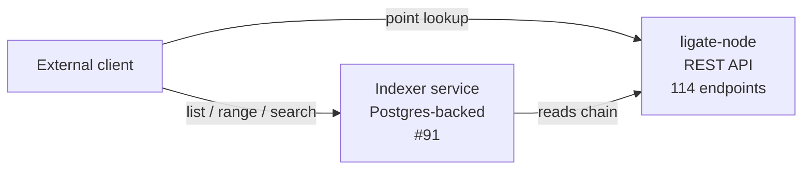

# Ligate Chain REST API reference

The full reference for every REST endpoint exposed by `ligate-node`. Audience: external integrators verifying attestations, querying balances, submitting transactions, watching block production.

The chain mounts **114 endpoints** on a default v0 devnet runtime, all auto-discovered from the runtime composition by the Sovereign SDK. Every chain-API path is **mounted under the `/v1/` prefix** ([#149](https://github.com/ligate-io/ligate-chain/issues/149)) so future breaking schema changes can land at `/v2/...` without colliding with existing clients. Operator-facing paths (`/health`, `/ready`, and `/metrics` on its own port) stay unversioned because they don't change schema across API revisions.

This document organizes the chain API by use case with curl examples for the most-hit endpoints. For the canonical machine-readable surface on any running node, the OpenAPI 3 spec is at `/v1/openapi-v3.json` and an interactive Swagger UI is at `/v1/swagger-ui`. If this document drifts from a running node, those two are the source of truth.

## URL versioning policy

| Surface | Path | Versioned? |
|---|---|---|
| Chain API (ledger / sequencer / rollup / modules / openapi spec) | `/v1/...` | yes |
| Liveness probe | `/health` | no (always 200) |
| Readiness probe | `/ready` | no (always `SyncStatus`-shaped) |
| Prometheus metrics | `:9100/metrics` (separate port) | no (Prometheus convention) |

Pre-public-devnet, breaking changes inside `/v1/` are coordinated by chat between Ligate Labs and design partners. Post-public-devnet, breaking changes bump to `/v2/` and the previous version stays mounted for one ladder rung (see [`upgrades.md`](upgrades.md) for the chain-id ladder + deprecation policy).

> **Note for tests.** The SDK's `sov_test_utils::TestRunner` mounts the chain API at unprefixed paths (`/modules/...`, `/ledger/...`, `/sequencer/...`). The `/v1/` prefix is applied by the production blueprint (`crates/rollup/src/{mock_rollup,celestia_rollup}.rs`'s `create_endpoints`). Integration tests that use TestRunner reflect the test-runner shape; the production binary reflects the versioned shape.

## Overview

The chain's REST API is **point lookups only by design**. List, range, time-bucketed, by-submitter, aggregation, top-N, and search queries do not live on the chain. They live in the indexer service ([#91](https://github.com/ligate-io/ligate-chain/issues/91)), a separate process that reads the chain's REST plus future event firehose and writes into Postgres.

Three reasons for the boundary, documented in [`attestation-v0.md`](attestation-v0.md#whats-deliberately-not-here):

1. The chain's data is keyed for verification, not search. A `list_by_schema` query would scan the full attestations map on every consensus node.
2. Adding a secondary index is a hard fork.
3. Range and aggregation queries have a better home in a service that owns its own database.

If a query can be answered with a single direct lookup against existing state, it is fair game for the chain. If it needs scanning, sorting, joining, or windowing, it belongs in the indexer.



## Quick start

Boot a single-node devnet against MockDa from the repo root (full setup in [`devnet/README.md`](../../devnet/README.md)):

```bash
cargo run --bin ligate-node
```

The REST API binds to `127.0.0.1:12346` per [`devnet/rollup.toml`](../../devnet/rollup.toml). Verify it is up:

```bash
curl http://127.0.0.1:12346/v1/rollup/sync-status
```

Browse the live OpenAPI surface in your browser at `http://127.0.0.1:12346/v1/swagger-ui`, or pull the JSON spec at `http://127.0.0.1:12346/v1/openapi-v3.json`.

## Top-level path map

| Prefix | Count | Purpose | Source |
|---|---|---|---|
| `/v1/ledger/...` | 17 | Block, batch, transaction, event queries | `sov-ledger-apis` |
| `/v1/sequencer/...` | 6 | Transaction submission, sequencer status, mempool events | `sov-sequencer` |
| `/v1/rollup/...` | 6 | Chain meta: sync status, gas price, dedup, schema, simulation | `sov-rollup-apis` |
| `/v1/modules/...` | 85 | Per-module state and custom queries (auto-mounted plus `HasCustomRestApi`) | each module |

Every path is GET unless explicitly marked POST.

The four module-related paths outside the per-module breakdown:

- `GET /v1/modules`: list every mounted module
- `GET /v1/modules/{moduleName}`: metadata for one mounted module
- The remaining 83 are per-module endpoints listed in §5.

## 1. Ledger queries

### Slots

| Path | Returns |
|---|---|
| `GET /v1/ledger/slots/latest` | The latest slot |
| `GET /v1/ledger/slots/finalized` | The latest finalized slot |
| `GET /v1/ledger/slots/{slotId}` | A slot by id (height or hash) |
| `GET /v1/ledger/slots/{slotId}/events` | Events emitted in a slot |
| `GET /v1/ledger/slots/{slotId}/batches/{batchOffset}` | The Nth batch in the named slot |
| `GET /v1/ledger/slots/{slotId}/batches/{batchOffset}/txs/{txOffset}` | The Mth transaction of the Nth batch |
| `GET /v1/ledger/slots/{slotId}/batches/{batchOffset}/txs/{txOffset}/events/{eventOffset}` | One event of one tx of one batch of one slot |

`{slotId}` accepts a height (e.g. `123`), a hash (`0x...`), or the literals `latest` and `finalized`.

### Batches and transactions

| Path | Returns |
|---|---|
| `GET /v1/ledger/batches/{batchId}` | A batch by id |
| `GET /v1/ledger/batches/{batchId}/txs/{txOffset}` | The Mth transaction of a batch |
| `GET /v1/ledger/batches/{batchId}/txs/{txOffset}/events/{eventOffset}` | One event of one tx of one batch |
| `GET /v1/ledger/txs/{txId}` | A transaction by id |
| `GET /v1/ledger/txs/{txId}/events/{eventOffset}` | The nth event emitted by this transaction |

### Events

| Path | Returns |
|---|---|
| `GET /v1/ledger/events` | The event index, paginated |
| `GET /v1/ledger/events/latest` | The most recent event |
| `GET /v1/ledger/events/counts` | Per-key event counts |
| `GET /v1/ledger/events/{eventId}` | A single event by id |

### Aggregated proofs

| Path | Returns |
|---|---|
| `GET /v1/ledger/aggregated-proofs/latest` | The latest aggregated zk proof |

### Examples

Latest slot:

```bash
curl http://127.0.0.1:12346/v1/ledger/slots/latest
```

Slot by height:

```bash
curl http://127.0.0.1:12346/v1/ledger/slots/42
```

Last 10 events:

```bash
curl 'http://127.0.0.1:12346/v1/ledger/events?limit=10'
```

A general-purpose live event firehose for arbitrary subscriptions is tracked in [#92](https://github.com/ligate-io/ligate-chain/issues/92). Until that ships, polling `/v1/ledger/events` is the supported path for "what just happened on chain".

## 2. Sequencer (transaction submission, mempool)

| Path | Method | Purpose |
|---|---|---|
| `/v1/sequencer/txs` | POST | Submit a transaction. Body is a hex-encoded signed tx. |
| `/v1/sequencer/txs/{txHash}` | GET | Look up a submitted transaction by its hash |
| `/v1/sequencer/txs/{txHash}/status` | GET | Inclusion status of a submitted transaction |
| `/v1/sequencer/ready` | GET | 200 if ready, 503 with details if not |
| `/v1/sequencer/unstable/events` | GET | Stream of mempool / sequencer events. **Unstable**: shape may change without notice. |
| `/v1/sequencer/unstable/events/{eventOffset}` | GET | One unstable event by offset |

Submitting a transaction:

```bash
curl -X POST http://127.0.0.1:12346/v1/sequencer/txs \
  -H 'content-type: application/json' \
  -d '{"body":"0xa1b2c3..."}'
```

The response is a tx hash (queue receipt, not finality). To check inclusion, poll `/v1/sequencer/txs/{txHash}/status` for sequencer-side status, or `/v1/ledger/txs/{txHash}` for ledger-side inclusion.

The `/v1/sequencer/unstable/events` surface is **unstable by design**: it is the in-process queue of sequencer events (admit, reject, include) and shape changes are routine. Production integrations should use `/v1/ledger/events` once a transaction lands on chain.

## 3. Rollup meta

| Path | Method | Returns |
|---|---|---|
| `/v1/rollup/sync-status` | GET | Whether the node is caught up to the DA layer |
| `/v1/rollup/base-fee-per-gas/latest` | GET | The current per-gas base fee, denominated in `$LGT` |
| `/v1/rollup/constants` | GET | Governance-tunable constants (current values; see [#40](https://github.com/ligate-io/ligate-chain/issues/40) for the constants-to-state migration) |
| `/v1/rollup/schema` | GET | **Universal-wallet TX schema**: type/template metadata for canonical Borsh encoding of every `CallMessage` variant. Not the OpenAPI spec; that is at `/v1/openapi-v3.json`. |
| `/v1/rollup/addresses/{credential_id}/dedup` | GET | Account dedup state for a given credential id (multi-credential accounts) |
| `/v1/rollup/simulate` | POST | Dry-run a transaction. Returns the result without committing state. |

`/v1/rollup/schema` is **not** the OpenAPI document despite the name. It is the universal-wallet schema that wallets and SDKs consume to encode transactions in a forward-compatible way: `chain_hash` plus a typed list of every `CallMessage` and its Borsh layout. The OpenAPI 3 description of every REST endpoint is at `/v1/openapi-v3.json` (see Quick start).

### Examples

Sync status:

```bash
curl http://127.0.0.1:12346/v1/rollup/sync-status
```

Current base fee:

```bash
curl http://127.0.0.1:12346/v1/rollup/base-fee-per-gas/latest
```

Universal-wallet TX schema (large; pipe through `jq` for readability):

```bash
curl -s http://127.0.0.1:12346/v1/rollup/schema | jq '.chain_hash, (.schema.types | keys | .[0:5])'
```

## 4. `attestation` module

Mounted at `/v1/modules/attestation`. Three custom point-lookup routes wired in [PR #93](https://github.com/ligate-io/ligate-chain/pull/93), plus 11 auto-mounted state endpoints.

### Custom routes

| Path | Returns | Status codes |
|---|---|---|
| `GET /v1/modules/attestation/schemas/{schemaId}` | One schema by Bech32 id (`lsc1...`) | 200, 400, 404 |
| `GET /v1/modules/attestation/attestor-sets/{attestorSetId}` | One attestor set by Bech32 id (`las1...`) | 200, 400, 404 |
| `GET /v1/modules/attestation/attestations/{schemaId}:{payloadHash}` | One attestation by compound id | 200, 400, 404 |

Status code semantics:

- **200**: typed JSON body returned (see types below)
- **400**: malformed Bech32m id (the id failed to decode)
- **404**: id well-formed but no record at that key

### Custom-route response types

```typescript
// GET /v1/modules/attestation/schemas/{schemaId}
type SchemaResponse = {
  schema: {
    id:               string;          // "lsc1..." Bech32m
    owner:            string;          // "lig1..." Bech32m
    name:             string;
    version:          number;
    attestor_set:     string;          // "las1..." Bech32m
    fee_routing_bps:  number;          // 0 to 5000
    fee_routing_addr: string | null;   // "lig1..." or null
  };
};

// GET /v1/modules/attestation/attestor-sets/{attestorSetId}
type AttestorSetResponse = {
  attestor_set: {
    id:        string;          // "las1..." Bech32m
    members:   string[];        // each "lpk1..." Bech32m
    threshold: number;          // M-of-N signatures required
  };
};

// GET /v1/modules/attestation/attestations/{schemaId}:{payloadHash}
type AttestationResponse = {
  attestation: {
    schema_id:    string;       // "lsc1..." Bech32m
    payload_hash: string;       // "lph1..." Bech32m
    submitter:    string;       // "lig1..." Bech32m
    timestamp:    number;       // unix seconds
    signatures:   {
      pubkey: string;           // "lpk1..." Bech32m
      sig:    string;           // hex
    }[];
  };
};
```

### Examples

Schema by id:

```bash
curl http://127.0.0.1:12346/v1/modules/attestation/schemas/lsc1...
```

Attestation by compound id (`schemaId:payloadHash`, both Bech32m):

```bash
curl 'http://127.0.0.1:12346/v1/modules/attestation/attestations/lsc1...:lph1...'
```

### Auto-mounted state endpoints

| Path | Returns |
|---|---|
| `GET /v1/modules/attestation/state/attestation-fee` | Current per-attestation fee in `$LGT` nanos |
| `GET /v1/modules/attestation/state/schema-registration-fee` | One-time fee to register a schema |
| `GET /v1/modules/attestation/state/attestor-set-fee` | One-time fee to register an attestor set |
| `GET /v1/modules/attestation/state/treasury` | Treasury address that receives non-routed fees |
| `GET /v1/modules/attestation/state/lgt-token-id` | The token id used for fees |
| `GET /v1/modules/attestation/state/total-treasury-collected` | Cumulative `$LGT` to treasury |
| `GET /v1/modules/attestation/state/schemas` | Schemas state-map metadata |
| `GET /v1/modules/attestation/state/schemas/items/{key}` | A schema by raw state-map key |
| `GET /v1/modules/attestation/state/attestor-sets` | Attestor-sets state-map metadata |
| `GET /v1/modules/attestation/state/attestor-sets/items/{key}` | An attestor set by raw key |
| `GET /v1/modules/attestation/state/attestations` | Attestations state-map metadata |
| `GET /v1/modules/attestation/state/attestations/items/{key}` | An attestation by raw compound key |
| `GET /v1/modules/attestation/state/builder-fees-collected` | Builder-fee tally state-map |
| `GET /v1/modules/attestation/state/builder-fees-collected/items/{key}` | Builder fees collected by one schema-routing address |

Prefer the custom routes (above) over the auto-mounted `state/{name}/items/{key}` routes for schema, attestor-set, and attestation lookups. The custom routes accept Bech32m ids directly; the auto-mounted routes need raw state-map keys.

### Why `list_by_schema` is not here

The attestation `StateMap<AttestationId, Attestation<S>>` is keyed by a 64-byte compound id. Point lookups are O(1); list-by-schema iteration is O(N) and would scan the full map on every consensus node. Adding a secondary index touches the write path, requires a hard fork, and is the wrong shape for a chain whose data is keyed for verification.

The full list of derived queries (by schema, by submitter, by time range, top-N, search) lives in the indexer ([#91](https://github.com/ligate-io/ligate-chain/issues/91)). See [`attestation-v0.md` §Query RPC](attestation-v0.md#query-rpc-read-path) for the architectural rationale.

## 5. `sov-bank` module (`$LGT` and other tokens)

Mounted at `/v1/modules/bank`. Five custom routes plus four auto-mounted state endpoints.

### Custom routes

| Path | Returns |
|---|---|
| `GET /v1/modules/bank/tokens` | Find a token id by name (query param `?name=...`) |
| `GET /v1/modules/bank/tokens/gas_token` | The chain's gas token (`$LGT`) metadata |
| `GET /v1/modules/bank/tokens/gas_token/balances/{address}` | A specific holder's `$LGT` balance |
| `GET /v1/modules/bank/tokens/{token_id}/balances/{address}` | A specific holder's balance for a non-gas token |
| `GET /v1/modules/bank/tokens/{token_id}/total-supply` | Total supply of a token |

`$LGT` uses 9 decimals on the wire (smallest unit = `1 nano = 0.000000001 $LGT`). All amounts in this API are base units (`u64` nanos).

### Auto-mounted state endpoints

| Path | Returns |
|---|---|
| `GET /v1/modules/bank/state/balances` | Balances state-map metadata |
| `GET /v1/modules/bank/state/balances/items/{key}` | Balance by raw key |
| `GET /v1/modules/bank/state/tokens` | Tokens state-map metadata |
| `GET /v1/modules/bank/state/tokens/items/{key}` | Token metadata by raw key |

### Examples

`$LGT` balance:

```bash
curl http://127.0.0.1:12346/v1/modules/bank/tokens/gas_token/balances/lig1...
```

```json
{
  "data": {
    "amount": "100000000000",
    "tokenId": "..."
  }
}
```

Total supply:

```bash
curl http://127.0.0.1:12346/v1/modules/bank/tokens/{tokenId}/total-supply
```

## 6. Other modules

### `accounts`

| Path | Returns |
|---|---|
| `GET /v1/modules/accounts/state/accounts` | Accounts state-map metadata |
| `GET /v1/modules/accounts/state/accounts/items/{key}` | An account by raw key |
| `GET /v1/modules/accounts/state/enable-custom-account-mappings` | Whether custom account mappings are enabled |

### `attester-incentives` (12 endpoints)

Bonded attesters, bonded challengers, finality params, slashing pools.

| Path | Returns |
|---|---|
| `GET /v1/modules/attester-incentives/state/bonded-attesters` | Bonded attesters state-map |
| `GET /v1/modules/attester-incentives/state/bonded-attesters/items/{key}` | One bonded attester by address |
| `GET /v1/modules/attester-incentives/state/bonded-challengers` | Bonded challengers state-map |
| `GET /v1/modules/attester-incentives/state/bonded-challengers/items/{key}` | One bonded challenger by address |
| `GET /v1/modules/attester-incentives/state/bad-transition-pool` | Bad-transition slashing pool |
| `GET /v1/modules/attester-incentives/state/bad-transition-pool/items/{key}` | One slashable transition by key |
| `GET /v1/modules/attester-incentives/state/light-client-finalized-height` | Last height the light client finalized |
| `GET /v1/modules/attester-incentives/state/maximum-attested-height` | Highest height attested by anyone |
| `GET /v1/modules/attester-incentives/state/minimum-attester-bond` | Minimum `$LGT` bond required to attest |
| `GET /v1/modules/attester-incentives/state/minimum-challenger-bond` | Minimum `$LGT` bond required to challenge |
| `GET /v1/modules/attester-incentives/state/reward-burn-rate` | Fraction of rewards burned vs paid |
| `GET /v1/modules/attester-incentives/state/rollup-finality-period` | Finality window in slots |

### `prover-incentives` (5 endpoints)

| Path | Returns |
|---|---|
| `GET /v1/modules/prover-incentives/state/bonded-provers` | Bonded provers state-map |
| `GET /v1/modules/prover-incentives/state/bonded-provers/items/{key}` | One bonded prover by address |
| `GET /v1/modules/prover-incentives/state/last-claimed-reward` | Most recent claimed prover reward |
| `GET /v1/modules/prover-incentives/state/minimum-bond` | Minimum `$LGT` bond required to prove |
| `GET /v1/modules/prover-incentives/state/proving-penalty` | Penalty applied for late or missing proofs |

### `operator-incentives` (1 endpoint)

| Path | Returns |
|---|---|
| `GET /v1/modules/operator-incentives/state/reward-address` | The address receiving operator rewards |

### `sequencer-registry` (4 endpoints)

| Path | Returns |
|---|---|
| `GET /v1/modules/sequencer-registry/state/known-sequencers` | Registered sequencers state-map |
| `GET /v1/modules/sequencer-registry/state/known-sequencers/items/{key}` | One sequencer's record |
| `GET /v1/modules/sequencer-registry/state/minimum-bond` | Minimum `$LGT` bond to register as sequencer |
| `GET /v1/modules/sequencer-registry/state/preferred-sequencer` | Genesis-preferred sequencer address |

### `uniqueness` (4 endpoints)

Tx replay protection.

| Path | Returns |
|---|---|
| `GET /v1/modules/uniqueness/state/nonces` | Nonces state-map |
| `GET /v1/modules/uniqueness/state/nonces/items/{key}` | The nonce for one address |
| `GET /v1/modules/uniqueness/state/generations` | Generations state-map (nonce-window epochs) |
| `GET /v1/modules/uniqueness/state/generations/items/{key}` | Generation for one address |

### `chain-state` (31 endpoints)

The largest auto-mount surface. Holds the kernel's view of slot history, rollup heights, code commitments, and oracle time. Useful for debugging consensus and reproducing historical state queries; rarely needed by application integrations.

The full list is in `/v1/openapi-v3.json`; categories:

- Slot bookkeeping: `slots`, `current-heights`, `next-visible-slot-number`, `slot-number-history`, `true-slot-number`, `true-slot-number-history`, `true-slot-number-to-rollup-height`, `true-to-visible-slot-number-history`
- State roots: `genesis-root`, `past-user-state-roots`, `accessory-pre-state-roots`, `accessory-past-user-state-roots`
- Code commitments (zkVM): `inner-code-commitment`, `outer-code-commitment`
- Time and gas: `time`, `oracle-time`, `oracle-time-nanos`, `gas-info`
- Setup mode and admin: `admin-address`, `operating-mode`, `setup-mode-termination-height`, `genesis-da-height`

Each lives at `/v1/modules/chain-state/state/{name}` (state values) or `/v1/modules/chain-state/state/{name}/items/{key}` (state maps).

## 7. State auto-mount pattern

Every module that derives `ModuleRestApi` gets auto-mounted state routes for each of its `StateMap`, `StateValue`, and `StateVec` fields:

| State item | Route pattern |
|---|---|
| `StateMap<K, V>` named `foo` | `GET /v1/modules/{module}/state/foo/items/{key}` (point lookup), `GET /v1/modules/{module}/state/foo` (metadata only) |
| `StateValue<V>` named `foo` | `GET /v1/modules/{module}/state/foo` |
| `StateVec<V>` named `foo` | `GET /v1/modules/{module}/state/foo/items/{index}` |

The `state/` segment is part of the auto-mount convention. Custom routes added via `HasCustomRestApi` are mounted at the module root without `state/`. The attestation module's `/v1/modules/attestation/schemas/{schemaId}` (custom) coexists with `/v1/modules/attestation/state/schemas/items/{key}` (auto-mounted) precisely because the prefixes differ.

### Historical state queries

All auto-mounted state endpoints accept two optional query parameters for historical lookups:

- `?rollup_height=N`: read state at the given rollup height
- `?slot_number=N`: read state at the given slot

Defaults to the head if neither is set. Mutually exclusive: pass one or the other, not both.

```bash
curl 'http://127.0.0.1:12346/v1/modules/attestation/state/attestation-fee?rollup_height=100'
```

Custom routes do not currently support historical queries; they always read the head.

## 8. Module discovery

| Path | Returns |
|---|---|
| `GET /modules` | A list of every mounted module |
| `GET /v1/modules/{moduleName}` | Metadata for one module: state-item names, custom-route paths |

Use `/v1/modules/{moduleName}` to inspect a module's state surface without grepping the runtime composition by hand.

## What lives in the indexer instead

The chain does not implement the following query patterns. They live in the indexer service ([#91](https://github.com/ligate-io/ligate-chain/issues/91)) and the live event stream ([#92](https://github.com/ligate-io/ligate-chain/issues/92)):

- `list_attestations_by_schema(schema_id, from?, to?, page, limit)`: the canonical example
- `list_schemas_by_owner(owner_address, page, limit)`
- `list_attestations_by_submitter(address, page, limit)`
- Time-range queries
- Top-N statistics, leaderboards, aggregates
- Full-text search
- WebSocket subscriptions for arbitrary event predicates

All of these read the chain's point-lookup REST plus the event firehose and serve back range, aggregate, and search responses without changing chain state. Standard pattern across mature chains (Cosmos via Numia / SubQuery, Ethereum via The Graph / Goldsky / Alchemy, Solana via Helius / Triton).

## WebSocket / live subscription

WebSocket subscriptions today are limited to four ledger streams. They are GET upgrades to WS on the regular HTTP listener (port 12346 on devnet):

| Path | Streams |
|---|---|
| `GET /v1/ledger/slots/latest/ws` | New slots as they arrive |
| `GET /v1/ledger/slots/finalized/ws` | Slots as they finalize |
| `GET /v1/ledger/slots/latest/events/ws` | Events from the head |
| `GET /v1/ledger/aggregated-proofs/latest/ws` | New aggregated proofs |

Connect from a JS client:

```javascript
const ws = new WebSocket('ws://127.0.0.1:12346/v1/ledger/slots/latest/ws');
ws.onmessage = (e) => console.log(JSON.parse(e.data));
```

A general-purpose live event firehose with arbitrary subscription predicates is tracked in [#92](https://github.com/ligate-io/ligate-chain/issues/92). Until that ships, polling `/v1/ledger/events` is the supported path for arbitrary on-chain event watching.

## Authentication and rate limits

The chain does not authenticate read queries. Anyone can hit any GET endpoint without credentials.

Devnet is fully open. Public devnet, when it ships ([#79](https://github.com/ligate-io/ligate-chain/issues/79)), may layer per-IP rate limits at the reverse-proxy layer. Those limits are operational, not protocol-level. The chain itself stays open.

For transaction submission, the authentication that matters happens inside the transaction body (the signature), not at the transport layer. Anyone can `POST /v1/sequencer/txs` with a transaction signed by any account. The sequencer accepts or rejects based on signature validity, nonce, and fee.

## Pagination

The chain's REST surface does not paginate, because the chain does not list. Every endpoint is a single-key lookup. Listing, range, and pagination patterns are an indexer concern.

The one near-exception is `/v1/ledger/events`, which accepts a `?limit=N` query parameter to bound the response. This is a recency cap, not pagination over arbitrary criteria.

## Error envelope

All endpoints use a consistent error envelope:

```json
{
  "errors": [
    {
      "title": "Schema not found",
      "details": "lsc1..."
    }
  ]
}
```

Status codes:

- **200 OK**: success, body matches the documented type
- **400 Bad Request**: input parsing failed (malformed Bech32m id, malformed JSON body, unknown query param)
- **404 Not Found**: input parsed cleanly but no record exists at the given key
- **503 Service Unavailable**: returned by `/v1/sequencer/ready` when the sequencer has not finished accepting state. Body details what is pending.
- **500 Internal Server Error**: storage error or internal panic. File a bug.

## Versioning

The REST surface is **not versioned in the URL** today. Two reasons:

1. Pre-mainnet, breaking changes are coordinated reset events tied to chain-id bumps (`ligate-devnet-1` to `ligate-devnet-2`). The chain id implicitly versions the API.
2. Post-mainnet, append-only changes (new endpoints, new optional fields) ship via soft fork without URL versioning. Breaking changes (renames, removals) require coordinated client upgrade and would be announced through the upgrade module ([#42](https://github.com/ligate-io/ligate-chain/issues/42)).

See [`upgrades.md`](upgrades.md) for the full soft-fork vs hard-fork policy.

## Cross-references

- [`attestation-v0.md`](attestation-v0.md): protocol specification (types, state layout, fees, invariants)
- [`addresses-and-signing.md`](addresses-and-signing.md): what `lig1...`, `lpk1...`, `lsc1...`, `las1...`, `lph1...` Bech32m prefixes mean
- [`upgrades.md`](upgrades.md): soft-fork vs hard-fork policy, `CHAIN_HASH` guard, post-mainnet upgrade flow
- [`docs/development/devnet.md`](../development/devnet.md): how to run a local node that serves these endpoints
- [`devnet/README.md`](../../devnet/README.md): default mock-DA boot recipe
- [`crates/modules/attestation/src/query.rs`](../../crates/modules/attestation/src/query.rs): source for the three custom attestation routes
- [`crates/client-rs/src/lib.rs`](../../crates/client-rs/src/lib.rs): Rust client SDK that wraps these endpoints

## Related issues

- [#21](https://github.com/ligate-io/ligate-chain/issues/21): closed, read-side REST surface for attestation
- [#91](https://github.com/ligate-io/ligate-chain/issues/91): open, indexer service where derived queries live
- [#92](https://github.com/ligate-io/ligate-chain/issues/92): open, WebSocket / SSE event firehose
- [#79](https://github.com/ligate-io/ligate-chain/issues/79): open, hosted public RPC at `rpc.ligate.io`
- [#111](https://github.com/ligate-io/ligate-chain/issues/111): closed by this document
