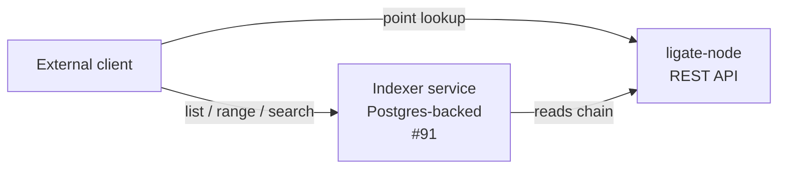

# Ligate Chain REST API reference

The full reference for every REST endpoint exposed by `ligate-node`. Audience: external integrators verifying attestations, querying balances, submitting transactions, watching block production.

For the canonical machine-readable surface on any running node, hit `GET /rollup/schema`. This document is the human-readable narrative version of that schema, organized by use case.

## Overview

The chain's REST API is **point lookups only by design**. List, range, time-bucketed, by-submitter, aggregation, top-N, and search queries do not live on the chain. They live in the indexer service ([#91](https://github.com/ligate-io/ligate-chain/issues/91)), a separate process that reads the chain's REST plus future event firehose and writes into Postgres.

Three reasons for the boundary, documented in [`attestation-v0.md`](attestation-v0.md#whats-deliberately-not-here):

1. The chain's data is keyed for verification, not search. A `list_by_schema` query would scan the full attestations map on every consensus node.
2. Adding a secondary index is a hard fork.
3. Range and aggregation queries have a better home in a service that owns its own database.

If a query can be answered with a single direct lookup against existing state, it is fair game for the chain. If it needs scanning, sorting, joining, or windowing, it belongs in the indexer.



## Top-level path map

| Prefix | Purpose | Source |
|---|---|---|
| `/ledger/...` | Block, batch, transaction, event queries | `sov-ledger-apis` |
| `/sequencer/...` | Transaction submission, sequencer status | `sov-sequencer` |
| `/rollup/...` | Chain meta: sync status, gas price, schema, simulation, dedup | `sov-rollup-apis` |
| `/modules/{name}/...` | Per-module state and custom queries | each module |

Every path is GET unless explicitly marked POST.

## 1. Ledger queries

### Slots

| Path | Returns |
|---|---|
| `GET /ledger/slots/latest` | The latest slot |
| `GET /ledger/slots/finalized` | The latest finalized slot |
| `GET /ledger/slots/{slotId}` | A slot by id (height or hash) |
| `GET /ledger/slots/latest/events` | Events in the latest slot |
| `GET /ledger/slots/{slotId}/batches/{n}` | Nth batch in the named slot |
| `GET /ledger/slots/{slotId}/batches/{n}/txs/{m}` | Mth transaction of nth batch |

### Batches and transactions

| Path | Returns |
|---|---|
| `GET /ledger/batches/{batchId}` | A batch by id |
| `GET /ledger/txs/{txId}` | A transaction by id |
| `GET /ledger/txs/{txId}/events` | Events emitted by this transaction |
| `GET /ledger/txs/{txId}/events/{n}` | The nth event emitted by this transaction |

### Events

| Path | Returns |
|---|---|
| `GET /ledger/events` | The event index, paginated |
| `GET /ledger/events/latest` | The most recent event |
| `GET /ledger/events/counts` | Per-key event counts |
| `GET /ledger/events/{eventId}` | A single event by id |

### Aggregated proofs

| Path | Returns |
|---|---|
| `GET /ledger/aggregated-proofs/latest` | The latest aggregated zk proof |

### WebSocket subscriptions (live)

| Path | Streams |
|---|---|
| `GET /ledger/slots/latest/ws` | New slots as they arrive |
| `GET /ledger/slots/finalized/ws` | Slots as they finalize |
| `GET /ledger/slots/latest/events/ws` | Events from the head |
| `GET /ledger/aggregated-proofs/latest/ws` | New aggregated proofs |

A general-purpose live event firehose for arbitrary subscriptions is tracked in [#92](https://github.com/ligate-io/ligate-chain/issues/92).

## 2. Sequencer (transaction submission)

| Path | Method | Purpose |
|---|---|---|
| `/sequencer/txs` | POST | Submit a transaction. Body is a hex-encoded signed tx. |
| `/sequencer/ready` | GET | Returns 200 once the sequencer has accepted state and is ready to ingest tx |
| `/sequencer/role` | GET | The sequencer's role (proposer, follower, etc.) |

Submitting a transaction:

```bash
curl -X POST http://localhost:12346/sequencer/txs \
  -H 'content-type: application/json' \
  -d '{"body":"0xa1b2c3..."}'
```

The response is a tx hash (queue receipt, not finality). To check inclusion, poll `/ledger/txs/{txId}` until present.

## 3. Rollup meta

| Path | Returns |
|---|---|
| `GET /rollup/sync-status` | Whether the node is caught up to the DA layer |
| `GET /rollup/base-fee-per-gas/latest` | The current per-gas base fee, denominated in `$LGT` |
| `GET /rollup/constants` | Governance-tunable constants (current values, see [#40](https://github.com/ligate-io/ligate-chain/issues/40) for the constants-to-state migration) |
| `GET /rollup/schema` | OpenAPI 3 spec for every endpoint on this node, generated from the runtime |
| `GET /rollup/addresses/{address}/dedup` | Account dedup state for a given address |
| `GET /rollup/addresses/{credentialId}/dedup` | Account dedup state by credential id (multi-credential accounts) |
| `POST /rollup/simulate` | Dry-run a transaction. Returns the result without committing state. |

`/rollup/schema` is the canonical machine-readable inventory. If this document drifts from the running node, that endpoint is the source of truth. `/rollup/schema` outputs the OpenAPI 3 schema for every route, including auto-mounted module endpoints (which depend on the runtime composition).

## 4. `sov-bank` module (`$LGT` and other tokens)

Mounted at `/modules/bank`.

| Path | Returns |
|---|---|
| `GET /modules/bank/tokens` | Find a token id by name |
| `GET /modules/bank/tokens/gas_token` | The chain's gas token (`$LGT`) metadata |
| `GET /modules/bank/tokens/gas_token/balances/{holder}` | A specific holder's `$LGT` balance |
| `GET /modules/bank/tokens/{tokenId}/balances/{holder}` | A specific holder's balance for a non-gas token |
| `GET /modules/bank/tokens/{tokenId}/total-supply` | Total supply of a token |
| `GET /modules/bank/tokens/{tokenId}/admins` | The set of addresses with admin rights on a token |

`$LGT` uses 9 decimals on the wire (smallest unit = `1 nano = 0.000000001 $LGT`). All amounts in this API are base units (`u64` nanos).

Example: query a `$LGT` balance.

```bash
curl http://localhost:12346/modules/bank/tokens/gas_token/balances/lig1...
```

```json
{
  "data": {
    "amount": "100000000000",
    "tokenId": "..."
  }
}
```

## 5. `attestation` module

Mounted at `/modules/attestation`. Three custom point-lookup routes wired in [PR #93](https://github.com/ligate-io/ligate-chain/pull/93):

| Path | Returns | Status codes |
|---|---|---|
| `GET /modules/attestation/schemas/{schemaId}` | One schema by Bech32 id (`lsc1...`) | 200, 400, 404 |
| `GET /modules/attestation/attestor-sets/{attestorSetId}` | One attestor set by Bech32 id (`las1...`) | 200, 400, 404 |
| `GET /modules/attestation/attestations/{schemaId}:{payloadHash}` | One attestation by compound id | 200, 400, 404 |

Status code semantics:

- **200**: typed JSON body returned (see types below)
- **400**: malformed Bech32m id (the id failed to decode)
- **404**: id well-formed but no record at that key

### Response types

```typescript
// GET /modules/attestation/schemas/{schemaId}
type SchemaResponse = {
  schema: {
    id:               string;          // "lsc1..." Bech32m
    owner:            string;          // "lig1..." Bech32m
    name:             string;
    version:          number;
    attestor_set:     string;          // "las1..." Bech32m
    fee_routing_bps:  number;          // 0 to 5000
    fee_routing_addr: string | null;   // "lig1..." or null
  };
};

// GET /modules/attestation/attestor-sets/{attestorSetId}
type AttestorSetResponse = {
  attestor_set: {
    id:        string;          // "las1..." Bech32m
    members:   string[];        // each "lpk1..." Bech32m
    threshold: number;          // M-of-N signatures required
  };
};

// GET /modules/attestation/attestations/{schemaId}:{payloadHash}
type AttestationResponse = {
  attestation: {
    schema_id:    string;       // "lsc1..." Bech32m
    payload_hash: string;       // "lph1..." Bech32m
    submitter:    string;       // "lig1..." Bech32m
    timestamp:    number;       // unix seconds
    signatures:   {
      pubkey: string;           // "lpk1..." Bech32m
      sig:    string;           // hex
    }[];
  };
};
```

### Why `list_by_schema` is not here

The attestation `StateMap<AttestationId, Attestation<S>>` is keyed by a 64-byte compound id. Point lookups are O(1); list-by-schema iteration is O(N) and would scan the full map on every consensus node. Adding a secondary index touches the write path, requires a hard fork, and is the wrong shape for a chain whose data is keyed for verification.

The full list of derived queries (by schema, by submitter, by time range, top-N, search) lives in the indexer ([#91](https://github.com/ligate-io/ligate-chain/issues/91)). See [`attestation-v0.md` §Query RPC](attestation-v0.md#query-rpc-read-path) for the architectural rationale.

## 6. Module state auto-mount pattern

Every module that derives `ModuleRestApi` gets auto-mounted state routes for each of its `StateMap`, `StateValue`, and `StateVec` fields:

| State item | Route pattern |
|---|---|
| `StateMap<K, V>` named `foo` | `GET /modules/{module}/foo/items/{key}` |
| `StateValue<V>` named `foo` | `GET /modules/{module}/foo/` |
| `StateVec<V>` named `foo` | `GET /modules/{module}/foo/items/{index}` |

For most modules the auto-mounted routes are the only REST surface. Modules that need typed input parsing, custom error messages, or compound keys add custom routes via `HasCustomRestApi` (the attestation module's three routes are an example).

The exact field names depend on the module's Rust source. Hit `/rollup/schema` on a running node for the complete enumeration.

## What lives in the indexer instead

The chain does not implement the following query patterns. They live in the indexer service ([#91](https://github.com/ligate-io/ligate-chain/issues/91)) and the live event stream ([#92](https://github.com/ligate-io/ligate-chain/issues/92)):

- `list_attestations_by_schema(schema_id, from?, to?, page, limit)`: the canonical example
- `list_schemas_by_owner(owner_address, page, limit)`
- `list_attestations_by_submitter(address, page, limit)`
- Time-range queries
- Top-N statistics, leaderboards, aggregates
- Full-text search
- WebSocket subscriptions for arbitrary event predicates

All of these read the chain's point-lookup REST plus the event firehose and serve back range / aggregate / search responses without changing chain state. Standard pattern across mature chains (Cosmos via Numia / SubQuery, Ethereum via The Graph / Goldsky / Alchemy, Solana via Helius / Triton).

## WebSocket / live subscription

WebSocket subscriptions today are limited to the four ledger streams listed in §1. A general-purpose live event firehose with arbitrary subscription predicates is tracked in [#92](https://github.com/ligate-io/ligate-chain/issues/92). Until that ships, polling `/ledger/events` is the supported path for "what just happened on chain".

## Authentication and rate limits

The chain does not authenticate read queries. Anyone can hit any GET endpoint without credentials.

Devnet is fully open. Public devnet, when it ships ([#79](https://github.com/ligate-io/ligate-chain/issues/79)), may layer per-IP rate limits at the reverse-proxy layer. Those limits are operational, not protocol-level. The chain itself stays open.

For transaction submission, the authentication that matters happens inside the transaction body (the signature), not at the transport layer. Anyone can `POST /sequencer/txs` with a transaction signed by any account. The sequencer accepts or rejects based on signature validity, nonce, and fee.

## Pagination

The chain's REST surface does not paginate, because the chain does not list. Every endpoint is a single-key lookup. Listing, range, and pagination patterns are an indexer concern.

## Error envelope

All endpoints use a consistent error envelope:

```json
{
  "errors": [
    {
      "title": "Schema not found",
      "details": "lsc1..."
    }
  ]
}
```

- **400 Bad Request**: input parsing failed (malformed Bech32m id, malformed JSON body, etc.)
- **404 Not Found**: input parsed cleanly but no record exists at the given key
- **500 Internal Server Error**: storage error, internal panic. File a bug.

## Versioning

The REST surface is **not versioned in the URL** today. Two reasons:

1. Pre-mainnet, breaking changes are coordinated reset events tied to chain-id bumps (`ligate-devnet-1` → `ligate-devnet-2`). The chain id implicitly versions the API.
2. Post-mainnet, append-only changes (new endpoints, new optional fields) ship via soft fork without URL versioning. Breaking changes (renames, removals) require coordinated client upgrade and would be announced through the upgrade module ([#42](https://github.com/ligate-io/ligate-chain/issues/42)).

See [`upgrades.md`](upgrades.md) for the full soft-fork vs hard-fork policy.

## Cross-references

- [`attestation-v0.md`](attestation-v0.md): protocol specification: types, state layout, fees, invariants
- [`addresses-and-signing.md`](addresses-and-signing.md): what `lig1...`, `lpk1...`, `lsc1...`, `las1...`, `lph1...` Bech32m prefixes mean
- [`upgrades.md`](upgrades.md): soft-fork vs hard-fork policy, `CHAIN_HASH` guard, post-mainnet upgrade flow
- [`docs/development/devnet.md`](../development/devnet.md): how to run a local node that serves these endpoints
- [`crates/modules/attestation/src/query.rs`](../../crates/modules/attestation/src/query.rs): source for the three custom attestation routes
- [`crates/client-rs/src/lib.rs`](../../crates/client-rs/src/lib.rs): Rust client SDK that wraps these endpoints

## Related issues

- [#21](https://github.com/ligate-io/ligate-chain/issues/21): closed: read-side REST surface for attestation
- [#91](https://github.com/ligate-io/ligate-chain/issues/91): open: indexer service, where derived queries live
- [#92](https://github.com/ligate-io/ligate-chain/issues/92): open: WebSocket / SSE event firehose
- [#79](https://github.com/ligate-io/ligate-chain/issues/79): open: hosted public RPC, where this API will be served at `rpc.ligate.io`
- [#111](https://github.com/ligate-io/ligate-chain/issues/111): closed by this document
